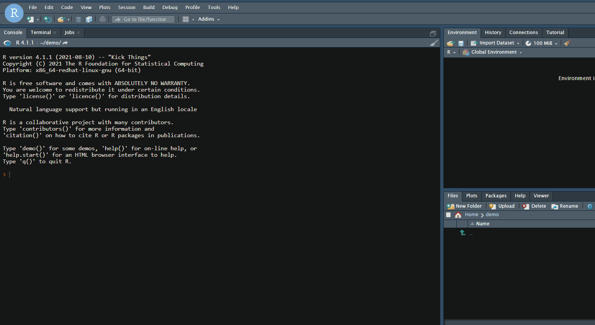
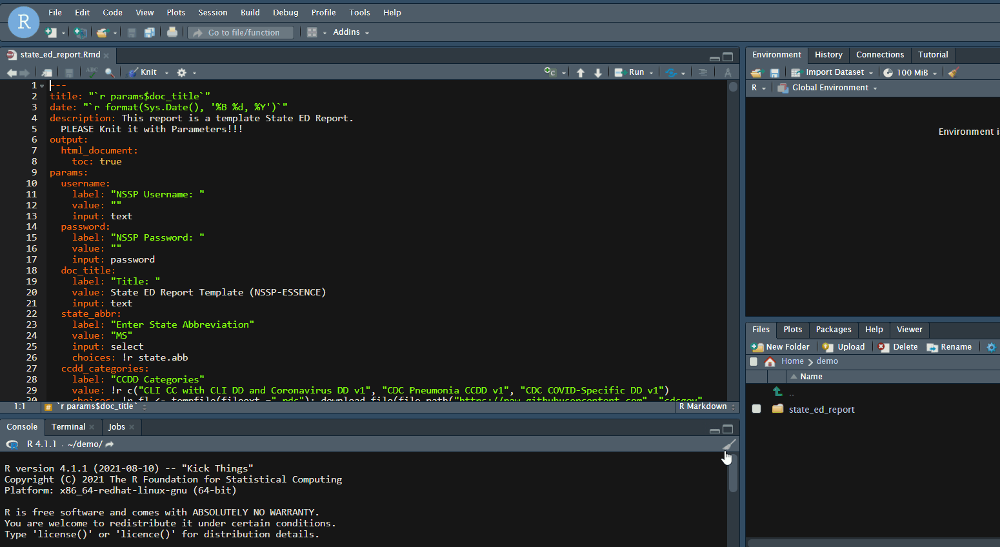

1. First, start a new R Markdown file **From Template** as demonstrated below:

2. Next, Knit the template **With Parameters** using the Knit button in your Rstudio IDE:

#### References:

[Knitting with parameters](https://bookdown.org/yihui/rmarkdown/params-knit.html)

